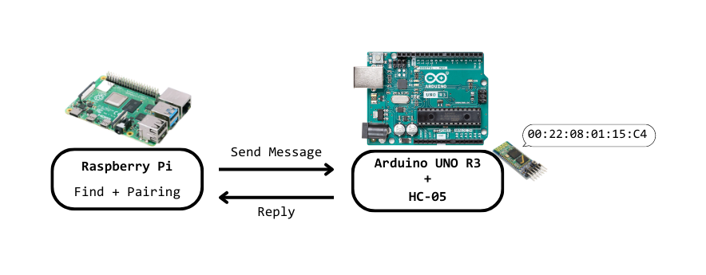
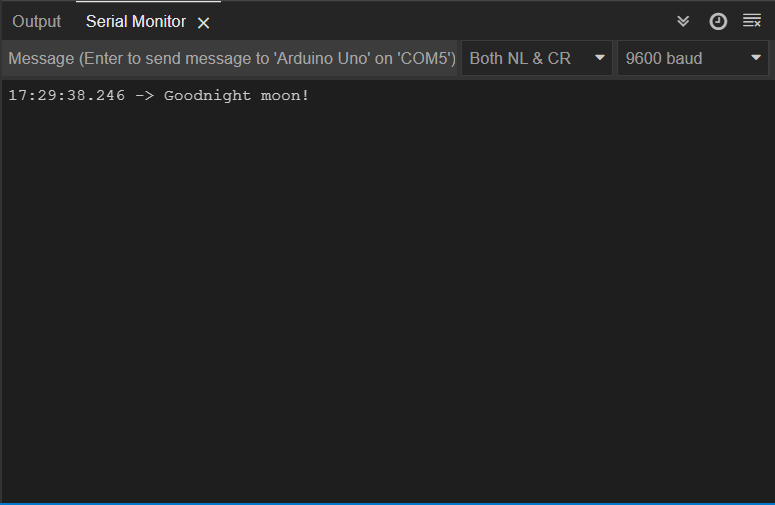
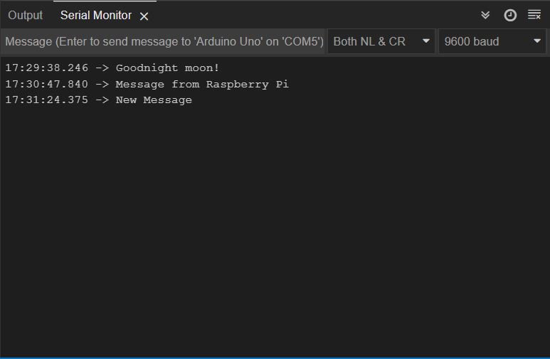
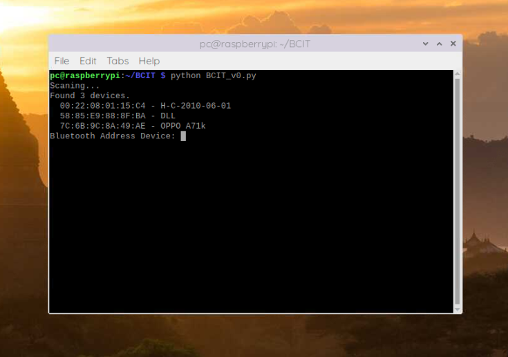
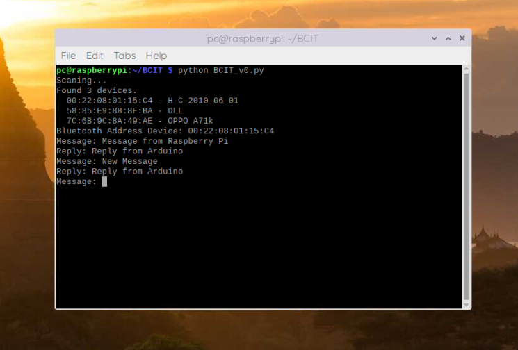

# 👋 Giao tiếp Bluetooth giữa Raspberry Pi và Arduino UNO


**GitBook tip:** your product docs aren't just a reference of all your features! use them to encourage folks to perform certain actions and discover the value in your product.


## Tổng quan về dự án

Bài hướng dẫn nầy được chia thành 2 phần:

1. Ghép nối Bluetooth với Raspberry Pi: Bạn sẽ được hướng dẫn cách ghép nối với một địa chỉ Bluetooth bất kỳ bằng Python mà không cần sử dụng command line.
2. Gửi tin nhắn giữa Raspberry Pi và Arduino: bạn sẽ được hướng dẫn cách gửi một tin nhắn đơn giản giữa.


<div data-full-width="true">

<figure><figcaption><p>Tổng quan về dự án</p></figcaption></figure>

</div>

* Raspberry sẽ tìm kiếm địa chỉ Bluetooth của Arduino.
* Nó sẽ ghép nối với Arduino thông qua địa chỉ Bluetooth.
* Sau khi ghép nối hoàn tất, nó sẽ mở cổng nối tiếp và gửi tin nhắn đến Arduino.
* Khi Arduino nhận được tin nhắn, nó sẽ trả lời lại Raspberry

Bạn có thể sửa đổi dự án này cho trường hợp cụ thể của bạn. Ví dụ: Thay vì gửi một tin nhắn đơn giản, bạn có thể gửi lệnh điều khiển đến Arduino để thực hiện bật hoặc tắt đèn LED.

## Điều kiện tiên quyết

1. Arduino IDE

Chúng tôi sẽ lập trình bằng Arduino IDE. Vì vậy, bạn cần cài đặt Arduino IDE của mình.

2. Raspberry Pi

Đảm bảo Raspberry Pi của bạn đã được cài sẵn OS và cài đặt Python trước khi bạn làm theo hướng dẫn tiếp theo.

## Phần cứng cần thiết

* Raspberry Pi 4B (hoặc Pi 3B trở lên)
* Arduino UNO R3
* Module Bluetooth HC-05 (hoặc HC-06)
* Breadboard
* Dây cắm breadboard

## Raspberry Pi

### Cài đặt các thư viện cần thiết

Cài đặt thư viện PySerial

```
sudo pip install pyserial
```

or:

```
sudo pip3 install pyserial
```

Cài đặt thư viện PyBluez:

```
sudo pip install PyBluez (sudo pip install pybluez2)
```

or:

```
sudo pip3 install PyBluez (sudo pip3 install pybluez2)
```

### Sourd Code

```
# Author of source code: ZhiQiang Zhu (zhiqiangzhu2301@gmail.com)
# Project's website: 
# Buy me coffee: https://paypal.me/zhiqiang2301


import serial
import signal
import bluetooth
import subprocess
import time
from time import sleep

def scan():

    print("Scaning...")  
    
    nearby_devices = bluetooth.discover_devices(lookup_names=True)
    print("Found {} devices.".format(len(nearby_devices)))

    for addr, name in nearby_devices:
        print("  {} - {} ".format(addr, name))

def bind(addr):
    cmd = 'sudo rfcomm bind rfcomm0 ' + str(addr)
    subprocess.check_output(cmd, shell = True )
    
scan()
address = input("Address Bluetooth Device: ")
bind(address)
sleep(3)
ser = serial.Serial(
    port="/dev/rfcomm0", 
    baudrate=9600,
    parity=serial.PARITY_ODD,
    stopbits=serial.STOPBITS_TWO,
    bytesize=serial.SEVENBITS
)

ser.isOpen()

while True:
    message = input("Message: ")
    ser.write(message.encode('utf-8'))
    while True:
        rcv = ser.read();
        sleep(0.03)
        rcv_left = ser.inWaiting()
        rcv += ser.readline(rcv_left)
        break
    print("Reply: {}".format(str(rcv, 'utf-8')))
```

### Code hoạt động như thế nào

Khai báo các thư viện cần thiết:

```
import serial
import signal
import bluetooth
import subprocess
import time
from time import sleep
```

Trong scan(), chúng tôi thực hiện tìm kiếm các địa chi Bluetooth được hiển thị xung quanh:

```
nearby_devices = bluetooth.discover_devices(lookup_names=True)
```

In danh sách các địa chỉ Bluetooth được tìm thấy ra terminal:

```
print("Found {} devices.".format(len(nearby_devices)))
for addr, name in nearby_devices:
    print("  {} - {} ".format(addr, name))
```

Chọn địa chỉ Bluetooth của Arduino của bạn:

```
address = input(" Bluetooth Address Device: ")
```

Trong bind(),

Sử dụng lệnh bind để ghi địa chỉ bluetooth của Arduino vào cổng rfcomm0 của Raspberry:

```
cmd = 'sudo rfcomm bind rfcomm0 ' + str(addr)
subprocess.check_output(cmd, shell = True )
```

Tạo một khoảng nghỉ để hoàn thành việc thực hiện lệnh bind trước khi mở cổng serial.

```
sleep(3)
```

Khởi tạo giao tiếp serial với PySerial:

```
ser = serial.Serial(
        port="/dev/rfcomm0", 
        baudrate=9600,
        parity=serial.PARITY_ODD,
        stopbits=serial.STOPBITS_TWO,
        bytesize=serial.SEVENBITS
    )
```

Mở cổng serial:

```
ser.isOpen()
```

Nhập một tin nhắn và gửi nó đến Arduino:

```
message = input("Message: ")
ser.write(message.encode('utf-8'))
```

Nhận phản hồi từ Arduino:

```
while True:
    rcv = ser.read();
    sleep(0.03)
    rcv_left = ser.inWaiting()
    rcv += ser.readline(rcv_left)
    break
print("Reply: {}".format(str(rcv, 'utf-8')))
```

## Arduino

### Schematic Diagram

### Sourd Code

Tải xuống hoặc sao chép mã sau vào Arduino IDE của bạn và tải nó lên bảng Arduino của bạn.

```
// Author of source code: ZhiQiang Zhu (zhiqiangzhu2301@gmail.com)
// Project's website: 
// Buy me coffee: https://paypal.me/zhiqiang2301


#include <SoftwareSerial.h>


// Arduino: RX(3), TX(2)
SoftwareSerial SerialDebug(3, 2); 

String message = "Reply from Arduino";
String rcv;


void setup() {
Serial.begin(9600);
while (!Serial) {
    ; // wait for serial port to connect.
}

Serial.println("Goodnight moon!");
SerialDebug.begin(9600);
}
void loop() {

    while(!SerialDebug.available()){
        delay(1);
    } // wait the answer

    rcv = SerialDebug.readString();
    Serial.println(rcv);
    delay(1000);
    SerialDebug.print(message);
} 
```

### Code hoạt động như thế nào

Khai báo các thư viện cần thiết:

```
#include <SoftwareSerial.h>
```

Xác định các chân phần mềm RX, TX của Arduino:

```
SoftwareSerial SerialDebug(3, 2);
```

Trong trường hợp này, câu trả lời từ Arduino là "Reply from Arduino".

```
String message = "Reply from Arduino";
String rcv;
```

Trong setup(), khởi tạo baudrate cho Serial và SoftwareSerial:

```
Serial.begin(9600);
while (!Serial) {
    ; // wait for serial port to connect.
}

Serial.println("Goodnight moon!");
SerialDebug.begin(9600); 
```

Trong loop(), chờ tin nhắn từ Raspberry

```
while(!SerialDebug.available()){
        delay(1);
} // wait the message
```

Nhận tin nhắn:

```
rcv = SerialDebug.readString();
Serial.println(rcv);
```

Gửi lại phản hồi đến Raspberry:

```
SerialDebug.print(message);
```

## Demo

### Với Arduino

Đi tới Tools > Board và chọn Arduino Uno. Đi tới Tools > Port và chọn cổng COM mà board của bạn được kết nối. Cuối cùng, nhấn nút tải lên để tải mã lên bảng của bạn.

Sau khi tải mã lên, hãy mở Serial Monitor với tốc độ truyền 9600 để xem điều gì đang xảy ra.

<div data-full-width="true">

<figure><figcaption><p>Arduino đang đợi message từ Raspberry Pi</p></figcaption></figure>

</div>

Tin nhắn được gửi từ Raspberry sẽ được in trong Serial Monitor.

<div data-full-width="true">

<figure><figcaption><p>Arduino in ra Serial Monitor các message được gửi từ Raspberry Pi</p></figcaption></figure>

</div>

### Với Raspberry

Source code được chúng tôi lưu như sau: BCIT/BCIT\_v0.py.

```
python BCIT_v0.py
```

Bạn cũng có thể lưu với đường dẫn khác, nhưng hãy đảm bảo rằng bạn gọi đúng đường dẫn mà bạn đã lưu.

<div data-full-width="true">

<figure><figcaption><p>Kết quả sau khi quét các thiết bị Bluetooth xung quanh</p></figcaption></figure>

</div>

Trong trường hợp này, địa chỉ Bluetooth của thiết bị Arduino của chúng tôi là 00:22:08:01:15:C4.

Hãy nhập đúng địa chỉ của thiết bị của bạn và bắt đầu gửi tin nhắn mà bạn muốn.

<div data-full-width="true">

<figure><figcaption><p>Gửi message và nhận phản hồi từ Arduino</p></figcaption></figure>

</div>

Tại đây, một phản hồi "Reply from Arduino" sẽ được in ra màn hình console của bạn sau mỗi lần nhận được phản hồi từ Arduino.

Nếu bạn nhận được kết quả tương tự, điều đó chứng tỏ giao tiếp nối tiếp qua Bluetooth đang hoạt động theo cả hai hướng. Chúc mừng! 🙂

## Kết luận

Bài hướng dẫn của chúng tôi đề xuất một giải pháp giúp bạn có thể thực hiện việc ghép nối cũng như việc gửi message thông qua Bluetooth giữa Raspberry và Arduino chỉ với 1 file python giúp khả năng tự động hóa tăng lên đáng kể.

Dựa trên giải pháp này, bạn có thể dễ dàng thay đổi cũng như mở rộng số lượng các thiết bị Bluetooth trong hệ thống của bạn.
